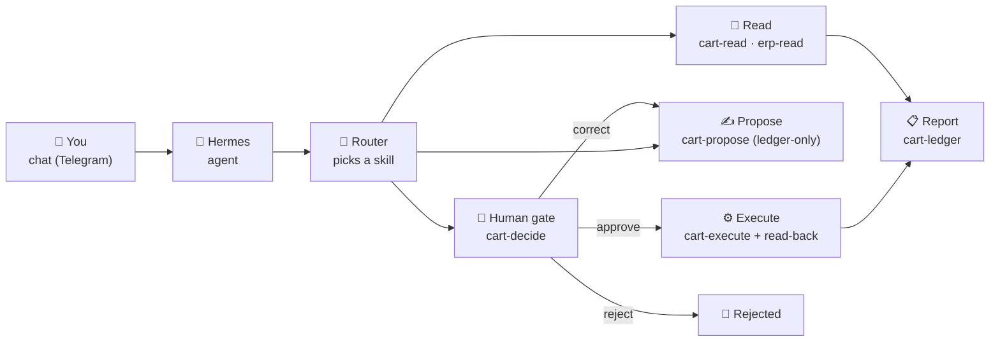
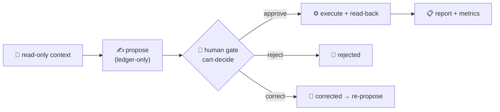
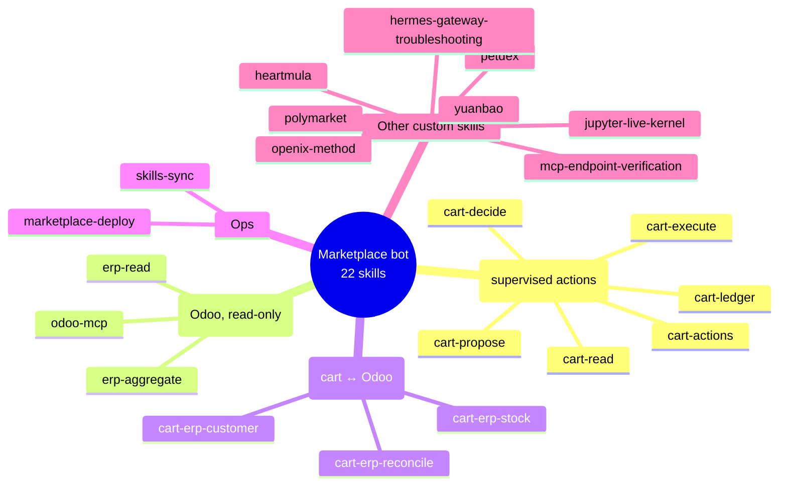

# Hermes Market Demo — Skills

A catalog of **22 agent skills** for the marketplace bot (**Marketplacebot**, a Hermes agent
on Telegram) — reusable workflows that run when you ask for them in chat. You describe what
you need in plain language; the agent selects and runs the right skill behind the scenes. You
never touch a console unless you want to.

The bot spans two systems — the **marketplace** (`cart_workflow` MCP) and the **Odoo ERP**
(`odoo` MCP, read-only) — joined by **keys** (product `sku`, customer `externalId`), not by
shared IDs.

## How it works



1. **You say what you need** — "who is this customer in our ERP?", "is this product in
   stock?", "propose an action", "approve it".
2. **The agent picks the router** that matches your intent (read, propose, decide, execute,
   report, or an ERP bridge).
3. **Routers delegate to workers** — focused skills that query, propose, gate, execute, or
   reconcile.
4. **You receive the result** in chat: a stock delta, a customer 360, a ledger report, or a
   proposed action awaiting your approval.

## The supervised action loop

Every write the bot can make goes through a human gate:



> **La IA propone. La persona decide.** The bot never writes on its own: it proposes to the
> approval ledger, a human approves (or rejects/corrects), the executor runs it, then the
> result is read back and reported.

## Chat your way to the marketplace

| You say... | The agent does |
|---|---|
| "Show me the catalog" | `cart-read` — lists products, orders, cart, reviews (read-only). |
| "Propose `<action>`" | `cart-propose` — writes a proposed action to the approval ledger (ledger-only). |
| "Approve / reject / correct that action" | `cart-decide` — the human gate; on approve, executes. |
| "Run it" / "what did it do?" | `cart-execute` — executes an approved action and reads back the result. |
| "What's in the approval ledger?" | `cart-ledger` — lists actions, gets one, or reports metrics. |
| "Look up a product / order / contact in Odoo" | `erp-read` — searches Odoo (read-only, `mcp_reader`). |
| "Revenue by country / pipeline by stage" | `erp-aggregate` — server-side group-by aggregations. |
| "Is this product in stock in Odoo?" | `cart-erp-stock` — joins marketplace `sku` ↔ Odoo `default_code`. |
| "Who is this customer in our ERP?" | `cart-erp-customer` — joins `externalId` ↔ `res.partner`. |
| "Did this order get invoiced?" | `cart-erp-reconcile` — order ↔ `sale.order` / invoice. |
| "Sync my skills to GitHub" | `skills-sync` — push / pull / status of this repo. |
| "Change the marketplace code" | `marketplace-deploy` — edit → validate → push → redeploy handoff. |

## Skill categories at a glance



## Join keys (cart ↔ Odoo)

| Entity | Marketplace key | Odoo key |
|---|---|---|
| Product | `sku` (`MP-<CAT>-<NN>`) | `product.product.default_code` |
| Customer | `externalId` (unmasked) | `res.partner.ref` / `email` |
| Order | order `id` / reference | `sale.order.name` / invoice `ref` |

The full mapping — including match normalization and current state — lives in the `erp-read`
skill's `cart-erp-join-keys.md` reference.

## Security invariants

- **Odoo MCP is read-only** — it authenticates as the scoped `mcp_reader` user (YOLO `read`);
  writes are deferred pending a licensed module.
- **Marketplace writes flow through the human gate** — the bot proposes, a human decides.
- **Email is masked** in `get_user_profile`; only `externalId` is exposed for joins (PII
  invariant).

## Sync

These skills are the version-controlled mirror of `~/.hermes/skills/`, kept in sync by the
`skills-sync` skill:

```bash
python3 skills/skills-sync/scripts/skills_sync.py status   # drift check
python3 skills/skills-sync/scripts/skills_sync.py push     # backup local → repo
python3 skills/skills-sync/scripts/skills_sync.py pull     # restore repo → local
python3 skills/skills-sync/scripts/skills_sync.py list     # show custom skills
```
